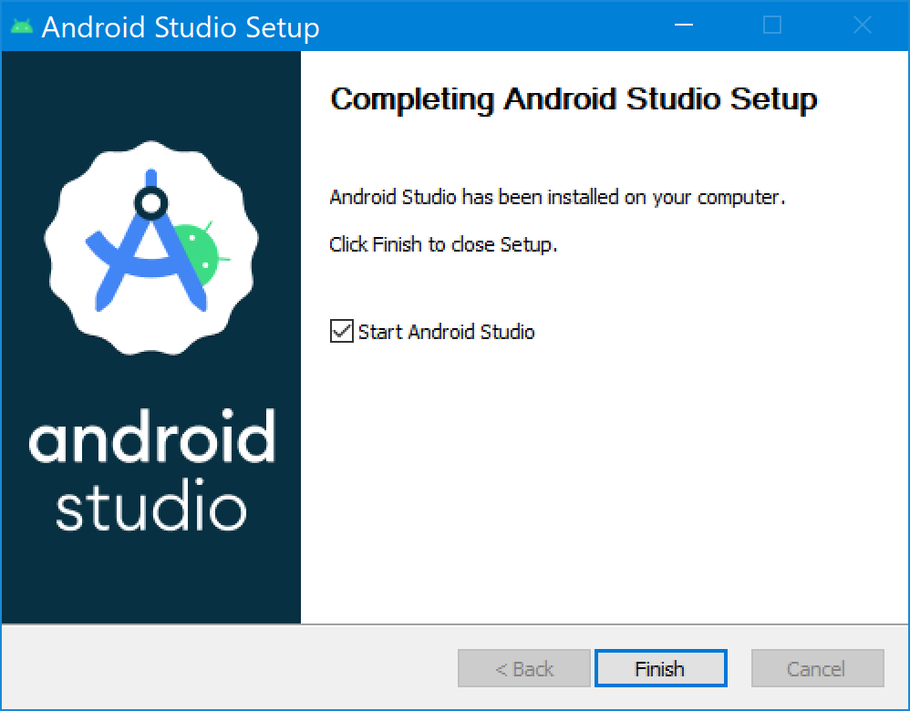
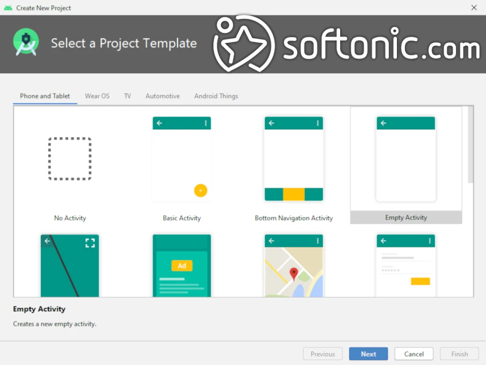

# Practial - 1

# Create working environment – Installation of Android SDK

# Setting up the Android SDK

Setting up the Android SDK (Software Development Kit) is essential for developing Android applications. Here's a step-by-step guide to installing the Android SDK:

1. **Download Android Studio**:
   - Go to the official [Android Studio website](https://developer.android.com/studio).
   - Download the latest version compatible with your operating system (Windows, macOS, or Linux).
   - Follow the installation instructions specific to your operating system.

2. **Install Android Studio**:
   - Run the downloaded installer and follow the on-screen instructions.
   - Choose a location for the Android Studio installation.
   - Once the installation completes, launch Android Studio.

3. **Configure Android Studio**:
   - Upon launching Android Studio for the first time, it will ask you to import settings. You can choose to import settings if you have any, or proceed with the default settings.
   - Android Studio will then download additional components and set up the necessary tools.

4. **Install Android SDK Components**:
   - Once Android Studio is set up, you need to install the Android SDK components.
   - Go to `Configure` > `SDK Manager`.
   - In the SDK Manager, you'll see a list of SDK Tools, SDK Platform, and other components.
   - Ensure that at least one version of the Android SDK Platform is installed. You can choose the latest stable version or a specific version depending on your requirements.
   - Select other SDK components you need, such as system images for different Android versions, build tools, and additional SDK tools.
   - Click "Apply" to download and install the selected components.

5. **Set up SDK Platforms**:
   - In the SDK Manager, navigate to the `SDK Platforms` tab.
   - Select the version(s) of Android you want to develop for. It's recommended to have the latest stable version installed, along with any sother versions you may need for compatibility testing.

6. **Set up SDK Tools**:
   - In the SDK Manager, navigate to the `SDK Tools` tab.
   - Ensure that the necessary tools like Android SDK Build-Tools, Android Emulator, Android SDK Platform-Tools, etc., are installed. You may need to update them to the latest version.

7. **Configure SDK Location**:
   - Android Studio will ask you to specify the SDK location during the initial setup. If you need to change it later, you can do so by going to `File` > `Project Structure` > `SDK Location`.

8. **Verify Installation**:
   - Once all necessary components are installed, you can verify the installation by creating a new Android project or opening an existing one.

9. **Create or Open a Project**:
   - To create a new project, go to `File` > `New` > `New Project` and follow the wizard to create a new Android application.
   - To open an existing project, go to `File` > `Open` and navigate to the project directory.

10. **Run a Sample App**:
    - Android Studio provides sample projects that you can use to test your setup. You can find them under `File` > `New` > `Import Sample`.

With these steps, you should have a working environment with the Android SDK installed and configured in Android Studio, ready for Android app development.

