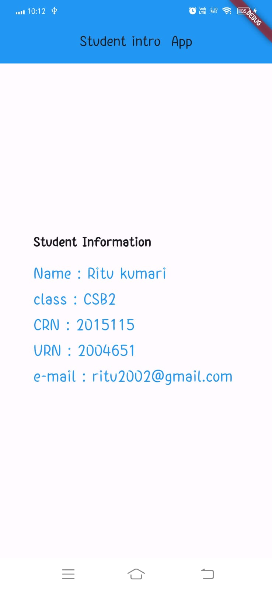

# Practical - 3
#Create an application that uses Layout Managers and Event Listeners.

```dart
import 'package:flutter/material.dart';
void main() {
  runApp(MyApp());
}
class MyApp extends StatelessWidget {
  @override
  Widget build(BuildContext context) {
    return MaterialApp(
      home: Scaffold(
        appBar: AppBar(
          centerTitle: true,
          title: Text('Student intro App'),
          backgroundColor: Colors.blue,
        ),
        body: const Center(
          child: Column(
            mainAxisAlignment: MainAxisAlignment.center,
            crossAxisAlignment: CrossAxisAlignment.start,
            children: <Widget>[
              Text(
                'Student Information ',
                style: TextStyle(
                  fontSize: 20.0,
                  fontWeight: FontWeight.bold,
                ),
              ),
              SizedBox(height: 10.0),
              Text(
                'Name : Ritu kumari',  // Replace 'John Doe' with the actual student name
                style: TextStyle(
                  fontSize: 24.0,
                  color: Colors.blue,
                ),
              ),
          Text(
            'class : CSB2',  // Replace 'John Doe' with the actual student name
            style: TextStyle(
              fontSize: 24.0,
              color: Colors.blue,
            ),
          ),
              Text(
                'CRN : 2015115',  // 
                style: TextStyle(
                  fontSize: 24.0,
                  color: Colors.blue,
                ),
              ),
              Text('URN : 2004651',
                style: TextStyle(
                  fontSize: 24.0,
                  color: Colors.blue,
                ),),
              Text('e-mail : ritu2511kumari@gmail.com ',
                style: TextStyle(
                  fontSize: 24.0,
                  color: Colors.blue,
                ),)
            ],
          ),
        ),
      ),
    );
  }
}