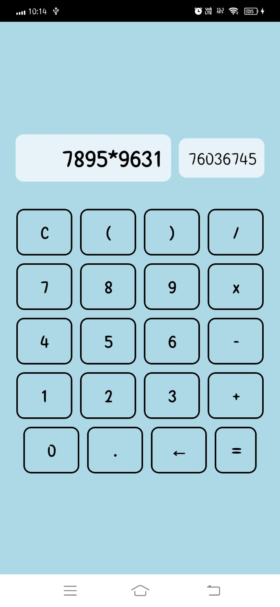

# Practical-4
# Create a calculator application.

```
import React, { useState } from 'react';
import {
  SafeAreaView,
  StatusBar,
  StyleSheet,
  Text,
  TouchableOpacity,
  useColorScheme,
  View,
} from 'react-native';
import { Appbar } from 'react-native-paper'; // Import Appbar from react-native-paper

function App(): React.ReactElement {
  const isDarkMode = useColorScheme() === 'dark';
  const [input, setInput] = useState('');
  const [result, setResult] = useState('');

  const handleInput = (value: string) => {
    setInput(prevInput => prevInput + value);
  };

  const handleClear = () => {
    setInput('');
    setResult('');
  };

  const handleBackspace = () => {
    setInput(prevInput => prevInput.slice(0, -1));
  };

  const handleCalculate = () => {
    try {
      setResult(eval(input).toString());
    } catch (error) {
      setResult('Error');
    }
  };

  return (
    <SafeAreaView style={[styles.container, { backgroundColor: '#ADD8E6' }]}>
      <StatusBar barStyle={isDarkMode ? 'light-content' : 'dark-content'} />
      <Appbar.Header>
        <Appbar.Content title="Ritu Kumari" /> {/* Set the title to "Ritu Kumari" */}
      </Appbar.Header>
      <View style={styles.inputContainer}>
        <View style={styles.inputBox}>
          <Text style={styles.inputText}>{input}</Text>
        </View>
        <View style={styles.outputBox}>
          <Text style={styles.outputText}>{result}</Text>
        </View>
      </View>
      <View style={styles.buttonContainer}>
        <TouchableOpacity style={styles.button} onPress={handleClear}>
          <Text style={styles.buttonText}>C</Text>
        </TouchableOpacity>
        {/* Other buttons */}
      </View>
    </SafeAreaView>
  );
}

const styles = StyleSheet.create({
  container: {
    flex: 1,
    alignItems: 'center',
    justifyContent: 'center',
  },
  inputContainer: {
    flexDirection: 'row',
    justifyContent: 'space-between',
    alignItems: 'center',
    padding: 20,
  },
  inputBox: {
    flex: 2,
    backgroundColor: 'rgba(255, 255, 255, 0.7)',
    borderRadius: 10,
    padding: 10,
  },
  outputBox: {
    flex: 1,
    backgroundColor: 'rgba(255, 255, 255, 0.7)',
    borderRadius: 10,
    padding: 10,
    marginLeft: 10,
  },
  inputText: {
    fontSize: 32,
    fontWeight: 'bold',
    textAlign: 'right',
  },
  outputText: {
    fontSize: 24,
    color: 'gray',
    textAlign: 'right',
  },
  buttonContainer: {
    flexDirection: 'row',
    flexWrap: 'wrap',
    justifyContent: 'center',
    marginTop: 10,
  },
  button: {
    width: '20%',
    height: 60,
    justifyContent: 'center',
    alignItems: 'center',
    borderWidth: 1,
    borderColor: 'darkgray',
    margin: 5,
    borderRadius: 10,
    backgroundColor: 'transparent',
  },
  buttonText: {
    fontSize: 24,
    fontWeight: 'bold',
    color: 'black',
  },
});

export default App;
