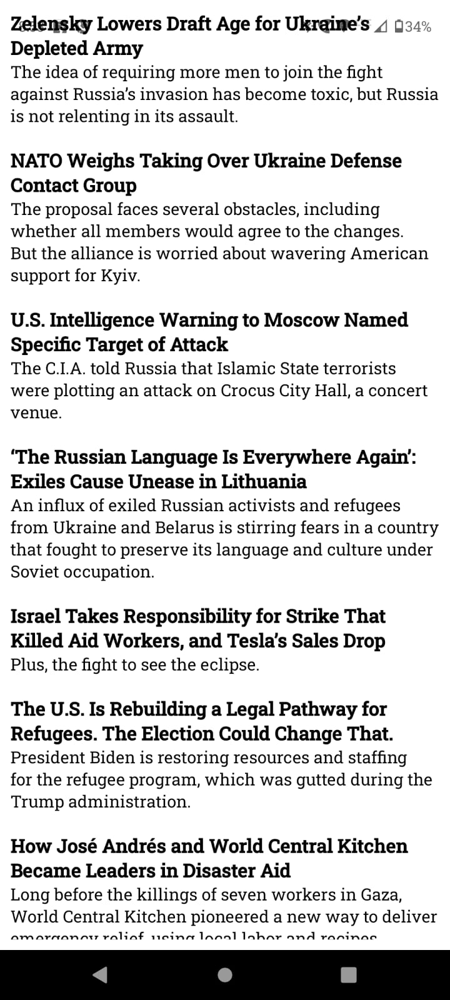

# Practical-8
# Create an application that makes use of RSS Feed

```
import React, { useState, useEffect } from 'react';
import { View, Text, FlatList, ActivityIndicator, StyleSheet } from 'react-native';
import * as rssParser from 'react-native-rss-parser';

const RSSFeedApp = () => {
  const [loading, setLoading] = useState(true);
  const [feedItems, setFeedItems] = useState([]);

  useEffect(() => {
    fetchRSSFeed();
  }, []);

  const fetchRSSFeed = async () => {
    try {
      const response = await fetch('https://example.com/feed.xml');
      const text = await response.text();
      const rss = await rssParser.parse(text);
      setFeedItems(rss.items);
      setLoading(false);
    } catch (error) {
      console.error('Error fetching RSS feed:', error);
      setLoading(false);
    }
  };

  const renderFeedItem = ({ item }) => {
    return (
      <View style={styles.feedItem}>
        <Text style={styles.title}>{item.title}</Text>
        <Text style={styles.description}>{item.description}</Text>
      </View>
    );
  };

  if (loading) {
    return (
      <View style={styles.loadingContainer}>
        <ActivityIndicator size="large" color="blue" />
      </View>
    );
  }

  return (
    <View style={styles.container}>
      <FlatList
        data={feedItems}
        renderItem={renderFeedItem}
        keyExtractor={(item) => item.id}
      />
    </View>
  );
};

const styles = StyleSheet.create({
  container: {
    flex: 1,
    padding: 10,
  },
  loadingContainer: {
    flex: 1,
    justifyContent: 'center',
    alignItems: 'center',
  },
  feedItem: {
    marginBottom: 20,
  },
  title: {
    fontSize: 18,
    fontWeight: 'bold',
  },
  description: {
    fontSize: 16,
  },
});

export default RSSFeedApp;
