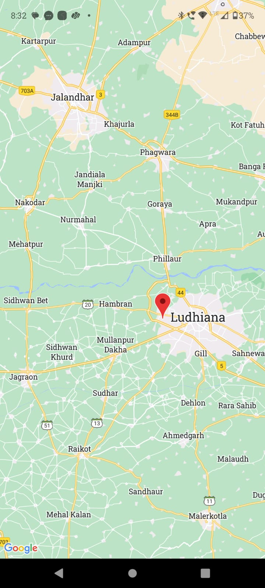

# Practical-6
# Create an application that uses GPS location information.

```react native
import React, { useState, useEffect } from 'react';
import { StyleSheet, Text, View, TouchableOpacity, Alert } from 'react-native';
import MapView, { Marker } from 'react-native-maps';
import * as Location from 'expo-location';

export default function App() {
  const [location, setLocation] = useState(null);

  useEffect(() => {
    getLocation();
  }, []);

  const getLocation = async () => {
    let { status } = await Location.requestForegroundPermissionsAsync();
    if (status !== 'granted') {
      Alert.alert('Permission Denied', 'Location permission is required to use this app.');
      return;
    }

    let location = await Location.getCurrentPositionAsync({});
    setLocation(location);
  };

  return (
    <View style={styles.container}>
      {location ? (
        <MapView
          style={styles.map}
          initialRegion={{
            latitude: location.coords.latitude,
            longitude: location.coords.longitude,
            latitudeDelta: 0.0922,
            longitudeDelta: 0.0421,
          }}
        >
          <Marker
            coordinate={{ latitude: location.coords.latitude, longitude: location.coords.longitude }}
            title="Your Location"
          />
        </MapView>
      ) : (
        <Text>Loading...</Text>
      )}
    </View>
  );
}

const styles = StyleSheet.create({
  container: {
    flex: 1,
  },
  map: {
    flex: 1,
  },
});
